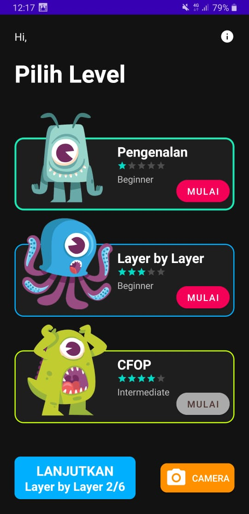
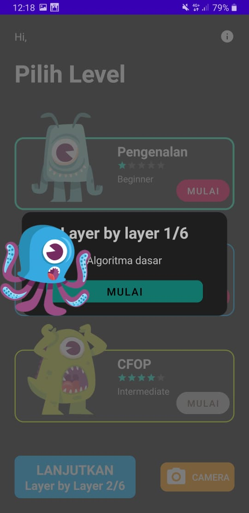
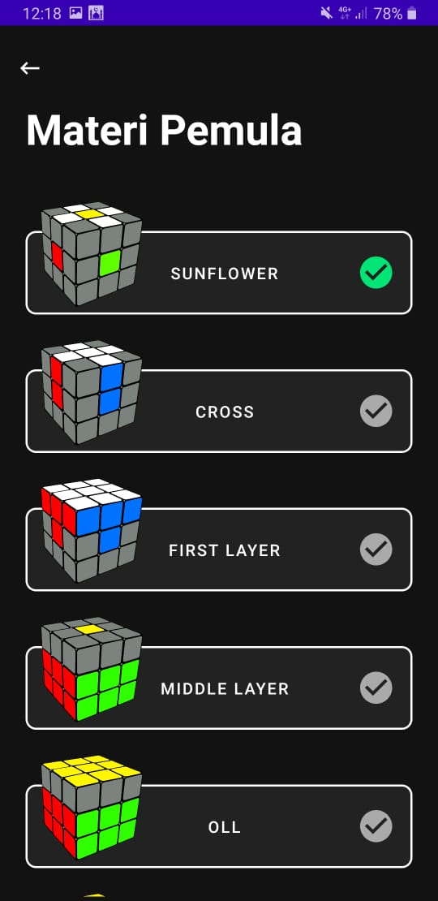
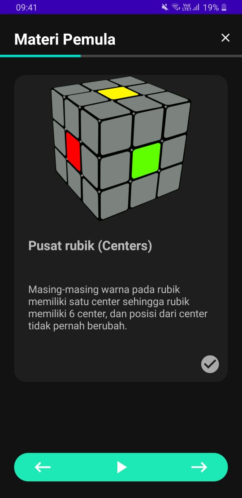
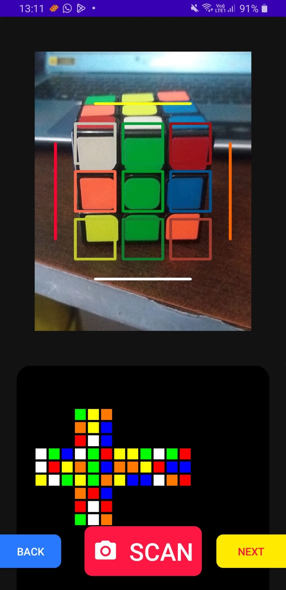
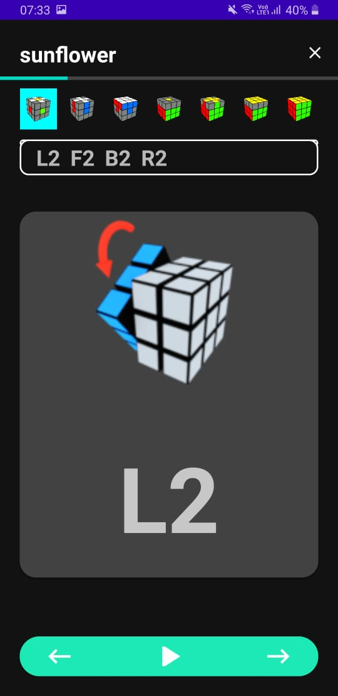

# 🧩 Utilization of Computer Vision in an Android-based Learning Application for Solving the 3x3x3 Rubik’s Cube  

This Android application utilizes **Computer Vision** to help users solve a **3x3x3 Rubik’s Cube** using real-time image processing. Built with **OpenCV**, the app captures the Rubik's Cube state using **CameraX**, processes the images with **C++ and Java**, and provides solving instructions.  

---

## 📸 Screenshots  

| Menu | Menu Clicked | Menu Materi |
|--------------|--------------|--------------|
|  |  |  |
| Materi | Cube Scanning | Solution Steps |
|  |  |  |


---

## 🚀 Features  

✅ **Real-time Cube Detection** using **OpenCV**  
✅ **CameraX Integration** for scanning the Rubik’s Cube  
✅ **C++ & Java Processing** for optimized performance  
✅ **Step-by-step Solution Display**  
✅ **User-friendly Interface**  

---

## 🛠 Tech Stack  

- **Android Studio** (Development Environment)  
- **OpenCV** (Computer Vision Processing)  
- **Java & C++** (Core Logic)  
- **CameraX** (Camera API for Scanning)  

---

## 📦 Installation  

### Prerequisites  

1️⃣ Install **Android Studio (latest version)**  
2️⃣ Clone this repository  
3️⃣ Ensure **OpenCV** is integrated into your project  

### Setup & Run  

```bash
# Clone the repository
git clone https://github.com/zakiburnama/JavaColorRecognition.git

# Open the project in Android Studio

# Sync dependencies and build the project

# Run the app on an emulator or a real device
